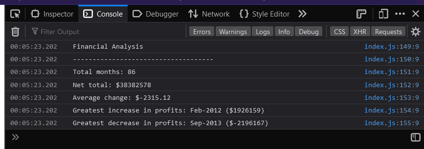

# Financial Analysis

## Module 4 Challenge
The purpose of this challenge was to use JavaScript to create a financial analysis of a 2D array of financial data (visible in the js file).
The task included calculating: 
* number of months in the array
* total sum of all financial data
* the average change in profit/loss between months
* the date with the greatest increase in profit 
* the date with the  greatest losses in profit
    * For the increase and decrease, I used the change in profit between months.

## Installation
The financial analysis can be run by accessing the console in a browser. 

## Potential useage
The calculations in this application could be reused with other data, including altering the data currently featured in the array, by editing the index.js file.  
As many of the calculations stored values in variables, the application should adapt well to changes to the original values.

## What I learned
From completing this application I learned:
* how to selct one value from a 2D array
* how to apply FOR loops to calculations
* how to combine IF conditions with FOR loops
* that sometimes the easiest solution is the correct one, and to try that first before overthinking.

## License
This application does not currently have a license as none was selected on set up of repo.

### URL to deployed application
https://jh871.github.io/Console-Finances/

### URL to GitHub repo
https://github.com/jh871/Console-Finances

### Screenshot for deployed application

